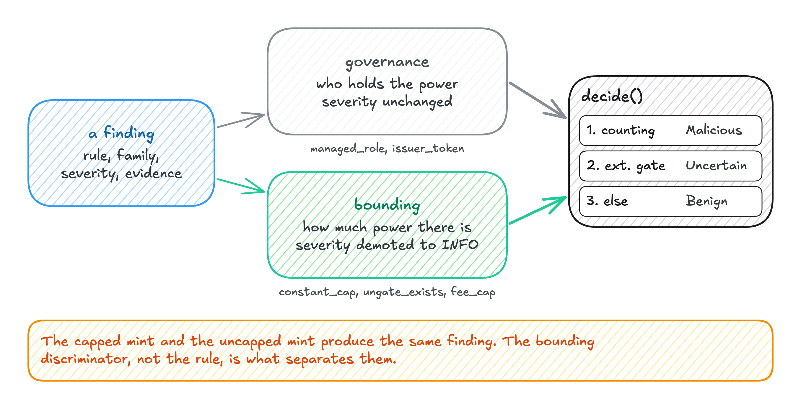
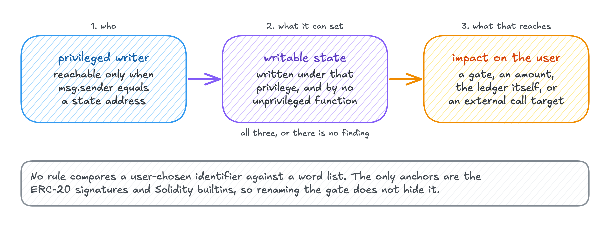
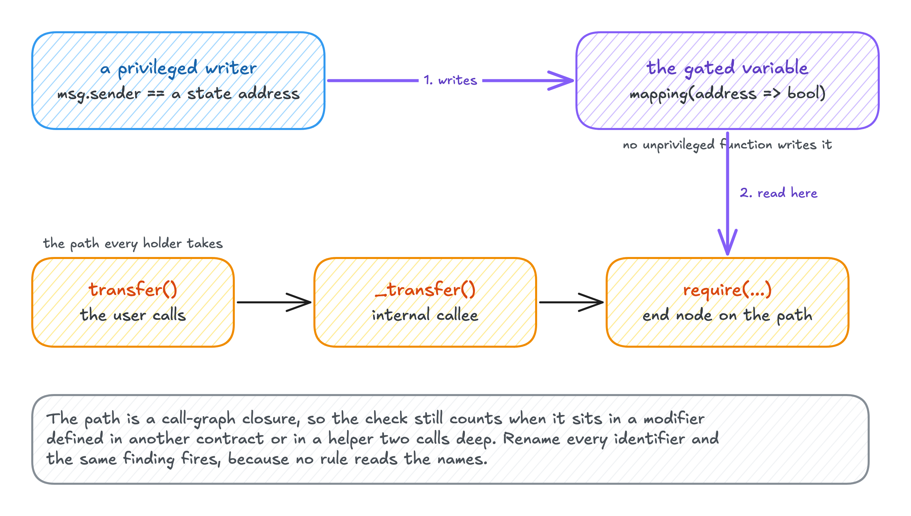
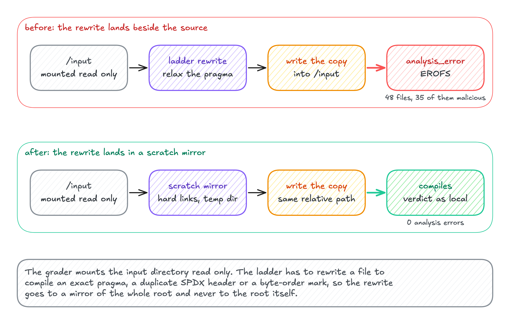
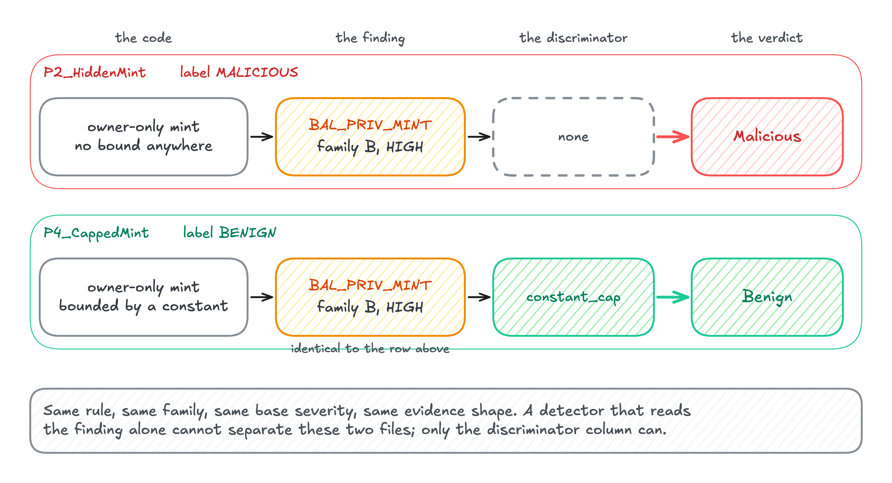
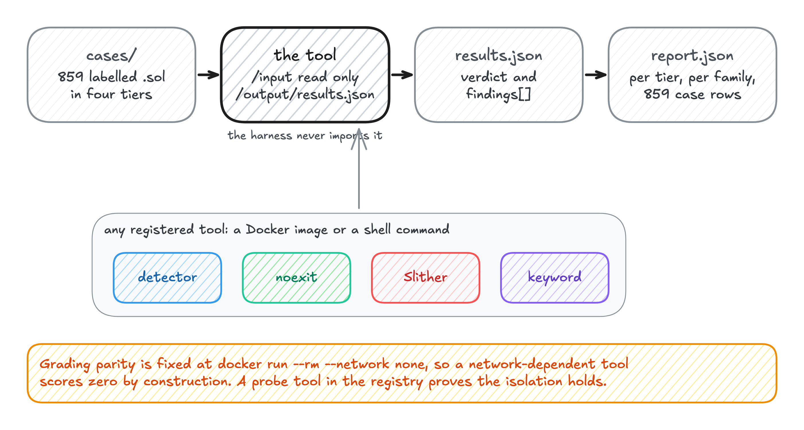
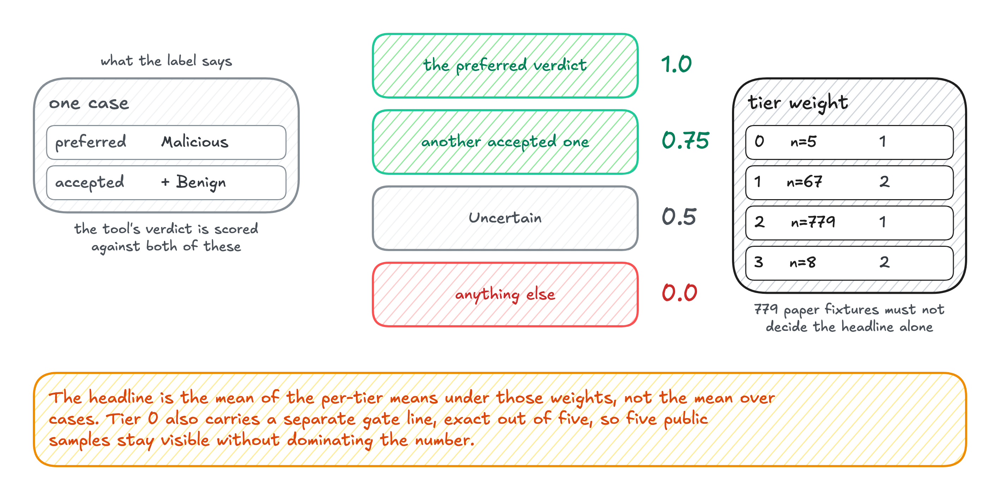
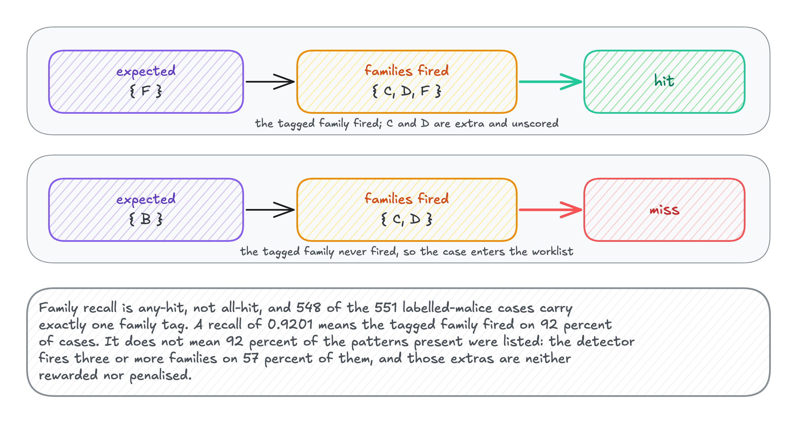

# trust404

EarthIsMine · TRUST404 Track 1 · two-engine offline Solidity malice detector + BAYBENCH.

Coding agents: see [AGENTS.md](AGENTS.md).

[](https://github.com/sdh2222/trust404/releases/tag/submission-rc2)

This repository **is** the submission. One directory of `.sol` files in, one JSON array on stdout. No network after the image is pulled. Do not start from BAYBENCH, `detector/` alone, or `noexit/` alone — those are internals. The only judge entry point is the ensemble image below, or `./run.sh <dir>` from this tree.

<p align="center">
  
</p>

A finding is adjusted by governance (severity unchanged) or bounding (demoted to INFO). `decide()` then maps a counting finding to Malicious, an external gate to Uncertain, else Benign. Source: [baybench_03_verdict_ladder.excalidraw](docs/research/figures/baybench_03_verdict_ladder.excalidraw). Spec: [docs/specs/detector.md](docs/specs/detector.md). How the two engines are merged: [docs/specs/ensemble.md](docs/specs/ensemble.md).

## TRUST404 Track 1 submission — judges start here

**Do this.** Pull the digest. Mount a flat directory of `*.sol` at `/input:ro`. Capture stdout. Treat stderr as logs only.

```bash
docker pull --platform linux/amd64 \
  ghcr.io/sdh2222/trust404-ensemble@sha256:0822a5a91630f53a1f4acf86ff97ecf5c83be5648361c4e1967ca6dde3a47440

mkdir -p input && cp /path/to/*.sol input/
docker run --rm --platform linux/amd64 --network none \
  --read-only --tmpfs /tmp --user 65534:65534 --cap-drop ALL \
  -v "$PWD/input":/input:ro \
  ghcr.io/sdh2222/trust404-ensemble@sha256:0822a5a91630f53a1f4acf86ff97ecf5c83be5648361c4e1967ca6dde3a47440 \
  > out.json
```

`--platform linux/amd64` is required on Apple Silicon and any other arm64 host. The image is amd64 only.

**Do not.** Do not give the container a network. Do not write to `/input`. Do not parse stderr as JSON. Do not expect a prompt, a config file, or a second invocation. Do not drop files that fail to compile — every input `*.sol` appears in the array, as `UNCERTAIN` if the engines could not decide. Do not run `bench run` as the graded command; that is our internal harness and prints a different schema.

Two independent offline engines sit behind that entry point: **detector** (Python on Slither IR: privilege → state → transfer-path reasoning) and **noexit** (TypeScript AST rules, tolerant parser). Per file **MALICIOUS if either engine says so, BENIGN only when detector says so, UNCERTAIN otherwise**. stdout is exactly one JSON array; logs go to stderr. Consensus was measured and rejected (0.872 vs 0.944 on the compiling BAYBENCH subset) because the engines never disagree by accusing a benign file; see [`docs/specs/ensemble.md`](docs/specs/ensemble.md).

| | organizers' +1/0/−1, 862 labelled | compiling subset (673) | benign FP | BAYBENCH weighted |
| --- | --- | --- | --- | --- |
| detector | 0.723 | 0.926 | 0 | 0.9703 |
| noexit | 0.672 | 0.847 | 0 | 0.9413 |
| **ensemble** | **0.754** | **0.944** | **0** | **0.9803** |

Measured 2026-09-20 on `submission-rc2` (detector Run 9, noexit vendored build `cbcef71a`, both all tiers `--repeat 2`; `reports/detector/`, `reports/noexit/`, `reports/ensemble/`). Organizers' metric: +1 correct, 0 UNCERTAIN, −1 wrong, averaged over the 862 files with a decisive truth (every Tier 2 source is dataset-malicious; Tier 0/1/3 use `preferred_verdict`); "compiling subset" = the 673 files the detector compiles. Alternatives measured and rejected: consensus 0.681, symmetric BENIGN 0.747 (+6 wrong), BENIGN-veto identical to the shipped rule on every file. Caveat: the corpus has no non-compiling benign file, so the cost side of "BENIGN only from detector" is unmeasured.

### Prerequisites

- **Docker-only path** (what judges use): Docker 24+ (any engine that runs `docker run --network none --read-only`). Add `--platform linux/amd64` when the host is arm64 (the image is amd64 only). The ensemble image is ~2 GB on disk (`docker images`; the detector base is ~1.4 GB of that). The compressed pull size of the published amd64 image is listed next to its digest under *Get the runtime* once `submission-rc2` is tagged. Nothing else is needed on the host.
- **Local path** (no Docker): Python ≥ 3.11 (`requires-python = ">=3.11"` in `pyproject.toml`); `uv` optional. Node ≥ 18 (`engines.node` in `noexit/package.json`). npm. The 46 solc binaries listed in `detector/solc_versions.txt`, installed by `scripts/setup_local.sh` (which also builds noexit). Then `./run.sh <dir>`.
- **Validation only**: `python -m detector.submission --validate out.json` (offline, no solc needed) and optional `check-jsonschema`.
- **Network: when**
  - Downloads: `docker pull` / `docker load`; `scripts/setup_local.sh` (pip + solc binaries); `npm ci`.
  - Graded run: `./run.sh` / `docker run --network none` — none.
- **Sizes / times**: solc artifacts are 1.5G (`du -sh ~/.solc-select/artifacts`). First `scripts/setup_local.sh` run is ~10–15 min (46 solc downloads + pip + npm/tsc); re-runs skip installed compilers and existing `noexit/node_modules`.

### Get the runtime

Use **one** of these. (1) is what was submitted. (2) and (3) are rebuilds of the same entry point.

1. **Published image (judges).** `linux/amd64` ensemble `ghcr.io/sdh2222/trust404-ensemble@sha256:0822a5a91630f53a1f4acf86ff97ecf5c83be5648361c4e1967ca6dde3a47440` (also tagged `:submission-rc2`, `:latest`; built by CI from tag `submission-rc2` = commit `3474ffc`). Pin the digest, not `:latest`. Optional local alias: `docker tag ghcr.io/sdh2222/trust404-ensemble@sha256:0822a5a91630f53a1f4acf86ff97ecf5c83be5648361c4e1967ca6dde3a47440 trust404/ensemble:latest`. If GHCR is unreachable, `docker load < trust404-ensemble-amd64.tar.gz` (454 MB) from the [release](https://github.com/sdh2222/trust404/releases/tag/submission-rc2) (sha256 `8daa316f7a81ec5f8346a732710bb7c1fcdb06d5fbcd3d4a5db69a609fa54eac`). Arm64 hosts add `--platform linux/amd64`. Verified 2026-09-20: this digest pulled by hash, run with `--network none --user 65534:65534 --read-only --cap-drop ALL --memory 4g --cpus 2 --pids-limit 512` on the five public samples → P1/P4 BENIGN, P2/P3/P5 MALICIOUS, both engines alive, schema-valid.
2. **Build from this tree.** `docker build --platform linux/amd64 --build-arg BASE=ghcr.io/sdh2222/trust404-detector:latest -t trust404/ensemble:latest .`
3. **No Docker.** `scripts/setup_local.sh && (cd noexit && npm ci --ignore-scripts && npx tsc -p tsconfig.json)` (Python ≥ 3.11, Node ≥ 18). Then `./run.sh <dir>`.

### Run

The graded command is the `docker run` at the top of this section (digest, `--network none`, `/input:ro`). After a local tag or a source build:

```bash
./run.sh ./cases > out.json
docker run --rm --network none -e ENSEMBLE_MODE=judge \
  -v "$PWD/cases":/input:ro trust404/ensemble:latest > out.json
```

`run.sh` prints the backend it chose on stderr; if one engine is unavailable it prints `run.sh: DEGRADED:` and runs the other; `ENSEMBLE_ENGINES=detector` (or `noexit`) forces a single engine. Do not force a single engine for grading.

### Validate

```bash
check-jsonschema --schemafile detector/schema/judge.schema.json out.json
JUDGE_SMOKE_REQUIRE_ENGINES=detector,noexit scripts/judge_smoke.sh ./cases
```

### Guarantees

These are invariants of the submitted image, not preferences.

- **stdout** is a nonempty JSON array and nothing else. Logs, progress, and `DEGRADED:` lines go to **stderr**.
- **No network** at runtime. Both engines and all solc / OpenZeppelin pins are in the image.
- Runs as **any uid** on a **read-only rootfs** (`--user 65534:65534 --read-only --tmpfs /tmp` is the intended judge wrap).
- Fits **2 vCPU / 4 GB / 10 min** (ensemble budget 540 s: detector 420 s global + 120 s per file, noexit seconds). Files past the budget are emitted as `UNCERTAIN`, never dropped.
- Exit 0 even when files or a whole engine fail (`[ensemble] DEGRADED:` on stderr).
- A `MALICIOUS` row always carries at least one code location (`evidence`).
- Verdicts are uppercase `MALICIOUS | BENIGN | UNCERTAIN`. `file` is the basename only.

### Single-engine images

- `docker pull ghcr.io/sdh2222/trust404-detector@sha256:5de570d30a3636712fb9b8ee10f23cfc9aaa80ba81da2c3669fb178f89d9363f` (also tagged `:submission-rc2`, `:latest`; the ensemble image above is built `FROM` this digest), then `docker tag ghcr.io/sdh2222/trust404-detector@sha256:5de570d30a3636712fb9b8ee10f23cfc9aaa80ba81da2c3669fb178f89d9363f trust404/detector:latest`
- or `docker load < trust404-detector-amd64.tar.gz` (322 MB) from the [release](https://github.com/sdh2222/trust404/releases/tag/submission-rc2) (sha256 `777ddac8989d53bc7bdeb35a73e29f2740a5f7ea7e5c6a56d79c3ae303aebb61`)
- previous: `submission-rc1` detector digest `947d696010cf61246793562dd708de1582cf732126b7714a74ef75b3540ca9dc` ([release](https://github.com/sdh2222/trust404/releases/tag/submission-rc1), tarball sha256 `fc897f1fa13a73bf18726c840a6876fa253c1177f9dc1bc8a8fc9bdc19957393`); rc2 adds only the plain-solc framework pin (`compile_force_framework="solc"`), verdicts unchanged on the bench
- the manifest is `linux/amd64` only; on an arm64 host (Apple Silicon) add `--platform linux/amd64` to `docker pull` / `docker run` and it executes under qemu

```bash
docker run --rm --network none -e DETECTOR_MODE=submission \
  -v "$PWD/cases":/input:ro trust404/detector:latest > out.json
```

`noexit/run.sh <dir>` after building `noexit/dist`.

Verdict derivation: [detector/README.md](detector/README.md) · [noexit/README.md](noexit/README.md). Specs: [docs/specs/ensemble.md](docs/specs/ensemble.md), [docs/specs/detector.md](docs/specs/detector.md).

## How it decides

Read this after the runbook, not instead of it. Two complete engines sit behind one entry point. `detector` is a Python / Slither-IR tool: a name-agnostic triple of privileged writer, writable state, and whether that state reaches the holder ([detector spec](docs/specs/detector.md)). `noexit` is a TypeScript AST rule engine ([noexit/README.md](noexit/README.md); pin: [noexit/UPSTREAM](noexit/UPSTREAM)). Per file the merge is MALICIOUS if either engine says so, BENIGN only when detector says so, UNCERTAIN otherwise ([ensemble verdict rule](docs/specs/ensemble.md#verdict-rule)).



Source: [baybench_01_predicate.excalidraw](docs/research/figures/baybench_01_predicate.excalidraw). Spec: [`analysis/privilege.py`](docs/specs/detector.md#analysisprivilegepy-research-5-predicate-1--name-agnostic).



Source: [baybench_02_transfer_path.excalidraw](docs/research/figures/baybench_02_transfer_path.excalidraw). Spec: [`analysis/transfer_path.py`](docs/specs/detector.md#analysistransfer_pathpy-research-5-predicate-3a3b-4-placement).


Source: [baybench_03_verdict_ladder.excalidraw](docs/research/figures/baybench_03_verdict_ladder.excalidraw). Spec: [`policy.py` decisive mode](docs/specs/detector.md#policypy--decisive-mode-phase-5-ratified-by-the-owner-2026-09-20-0255-replaces-the-phase-4-concealment-ladder-below).



Source: [baybench_04_scratch_mirror.excalidraw](docs/research/figures/baybench_04_scratch_mirror.excalidraw). Spec: [`compile.py` scratch mirror](docs/specs/detector.md#compilepy).



Source: [baybench_07_same_finding.excalidraw](docs/research/figures/baybench_07_same_finding.excalidraw). Spec: [discriminator classes](docs/specs/detector.md#policypy--decisive-mode-phase-5-ratified-by-the-owner-2026-09-20-0255-replaces-the-phase-4-concealment-ladder-below).

## BAYBENCH

BAYBENCH is **our** offline harness for iterating on the engines. It is not the judge entry point and its `results.json` is not the graded schema. Judges stay on the ensemble image above.



Source: [baybench_05_harness.excalidraw](docs/research/figures/baybench_05_harness.excalidraw). Spec: [purpose](docs/specs/baybench.md#purpose), [registry](docs/specs/baybench.md#registry--baybenchtoolsyaml).



Source: [baybench_06_scoring.excalidraw](docs/research/figures/baybench_06_scoring.excalidraw). Spec: [`scoring.py`](docs/specs/baybench.md#module-interfaces-baybench-package).



Source: [baybench_08_family_recall.excalidraw](docs/research/figures/baybench_08_family_recall.excalidraw). Spec: [`family_recall` in `scoring.py`](docs/specs/baybench.md#module-interfaces-baybench-package). Worklist: [docs/bench/misses.md](docs/bench/misses.md).

Offline harness for TRUST404 Track 1 detectors. A tool is a black box: it reads a directory of `.sol` files and writes one `results.json`. BAYBENCH scores that output identically for every teammate, then lists the misses to iterate on. Pattern and rule IDs come from [docs/research/track1-malice-patterns.md](docs/research/track1-malice-patterns.md); the spec is [docs/specs/baybench.md](docs/specs/baybench.md).

### Install

```bash
uv venv --python 3.12 .venv && uv pip install -e '.[dev]'
```

### Commands

```bash
bench run baseline_keyword --tier 1 --no-docker
bench coverage --cases cases
bench coverage baseline_keyword --tier 1 --no-docker
bench validate --tier 1
bench report
bench ingest-discord path/to/discord-export
bench ingest-paper piedpiper path/to/sources
```

`bench run` double-runs by default (`--repeat 2`), writes `reports/<tool>/report.md` and `report.json`, and prints weighted score, determinism, and compile-fail count. `ingest-discord` / `ingest-paper` are seams for Tier 0 / Tier 2 (BB-8, BB-9); they exit 2 until those tasks land.

### `results.json` shape

```json
{
  "tool": {"name": "my_tool", "version": "0.1"},
  "results": [
    {
      "file": "tier1/EXIT_ADDR_GATE/mal/mal.sol",
      "verdict": "Malicious",
      "reason": "",
      "findings": [
        {
          "rule_id": "EXIT_ADDR_GATE",
          "family": "A",
          "severity": "HIGH",
          "contract": "Token",
          "function": "setBots",
          "lines": [41, 47],
          "reasoning": "hardcoded allowlist"
        }
      ]
    }
  ]
}
```

`file` is relative to the staged input root (`<case.id>/<case.file>`). Verdicts are `Benign | Malicious | Uncertain`. Schema: `baybench/schema/result.schema.json`.

### Register a tool

Add an entry to `baybench/tools.yaml`:

```yaml
tools:
  - name: baseline_keyword
    image: baybench/baseline_keyword:latest          # docker mode
  - name: my_local_tool
    cmd: "python /path/tool.py --in {input} --out {output}/results.json"  # --no-docker
  - name: noexit
    cmd: "node noexit/dist/baybench.js {input} {output}/results.json"  # vendored engine, build first
```

`{input}` and `{output}` are substituted in command mode. Docker mode mounts them at `/input` (ro) and `/output`. `cmd` is also env-expanded (for example `${MY_TOOL_DIR}`) with cwd = repo root; an unset variable is a clear error.

```bash
(cd noexit && npm ci --ignore-scripts && npx tsc -p tsconfig.json)
.venv/bin/bench run noexit --no-docker
```

### Grading parity

Grading parity is `docker run --rm --network none`. Network-dependent tools score zero by construction. The bench image (`Dockerfile.bench`) bakes in `solc-select` compilers so `bench validate` runs offline (BB-11):

```bash
docker build -f Dockerfile.bench -t baybench .
docker run --rm --network none baybench validate
```

## Results

The live `submission-rc2` table is in [TRUST404 Track 1 submission — judges start here](#trust404-track-1-submission--judges-start-here).

### Paper snapshot (20 Sep 2026, n=859)

The four charts below freeze the results-paper run (detector 0.9714, noexit 0.9194, Slither 0.6298, keyword 0.4269). Ledger: [docs/research/earthismine-baybench-results.md](docs/research/earthismine-baybench-results.md). Paper: [docs/research/earthismine-baybench-paper.md](docs/research/earthismine-baybench-paper.md).


## Research

- [earthismine-baybench-paper.md](docs/research/earthismine-baybench-paper.md) ([PDF](docs/research/earthismine-baybench-paper.pdf)) — results paper for EarthIsMine on BAYBENCH. Track 1 is treated as scam-contract detection: a privileged writer to state that sits on the holder's transfer or exit path, or that touches balances directly. The detector implements that triple on Slither IR, adjusts findings with bounding vs governance discriminators, and resolves them through a three-step ladder. The note freezes one run; it is not the spec.
- [earthismine-baybench-paper-academic.md](docs/research/earthismine-baybench-paper-academic.md) ([PDF](docs/research/earthismine-baybench-paper-academic.pdf)) — the same snapshot written as a paper (predicate, decision layer, four-tier offline harness, measured evaluation and its limits).
- [earthismine-baybench-results.md](docs/research/earthismine-baybench-results.md) — number ledger for that snapshot.
- [track1-malice-patterns.md](docs/research/track1-malice-patterns.md) ([Korean](docs/research/track1-malice-patterns.ko.md)) — literature survey and the A–G family taxonomy the catalog uses.
- [docs/research/figures/](docs/research/figures/) — architecture diagrams (PNG + Excalidraw source).
- `docs/research/_md_to_paper.py` converts a research Markdown file to Typst (`python docs/research/_md_to_paper.py <md> [-o out.typ]`).
- `scripts/plot_baybench_compare.py` builds the `reports/baybench_*.png` charts from committed `reports/<tool>/report.json` (no usage docstring).

Also: [detector spec](docs/specs/detector.md) · [BAYBENCH spec](docs/specs/baybench.md) · [ensemble spec](docs/specs/ensemble.md) · [misses](docs/bench/misses.md) · [submission checklist](docs/submission-checklist.md) · [organizers' public-set rules](docs/judge/challenge_public/README.md).

## Repository layout

| path | owner | what it is |
|---|---|---|
| `detector/` | this repo (`sdh2222`) | Python detector on Slither IR. Spec: [docs/specs/detector.md](docs/specs/detector.md). |
| `noexit/` | Hojae (`ghwo336/T404`); never edited here | TypeScript AST detector, vendored. Pin: [noexit/UPSTREAM](noexit/UPSTREAM). |
| `tools/`, `run.sh`, root `Dockerfile` | shared | judges' entry point (`tools/ensemble.py`). Spec: [docs/specs/ensemble.md](docs/specs/ensemble.md). |
| `baybench/` | shared | offline harness. Spec: [docs/specs/baybench.md](docs/specs/baybench.md). |
| `cases/` | shared | labelled corpus (Tiers 0–3). |
| `reports/` | shared | `bench run` output and snapshot charts. |
| `docs/` | shared | specs, [misses](docs/bench/misses.md), research, [judge public set](docs/judge/challenge_public/README.md). |
| `scripts/` | shared | `setup_local.sh`, plot helpers. |

## Team

EarthIsMine. `detector` is this repo's (`sdh2222`). `noexit` is Hojae's ([ghwo336/T404](https://github.com/ghwo336/T404)), vendored under `noexit/`. How to work in the tree: [CONTRIBUTING.md](CONTRIBUTING.md). Agents: [AGENTS.md](AGENTS.md).
