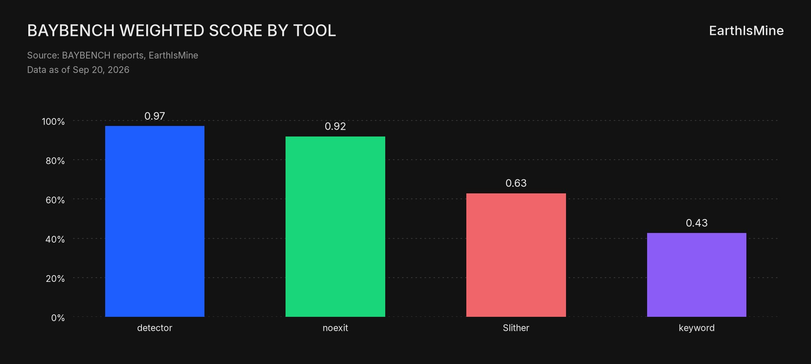
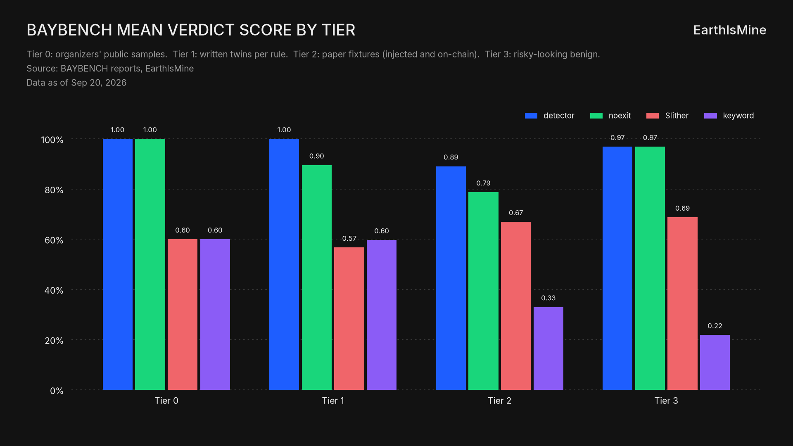
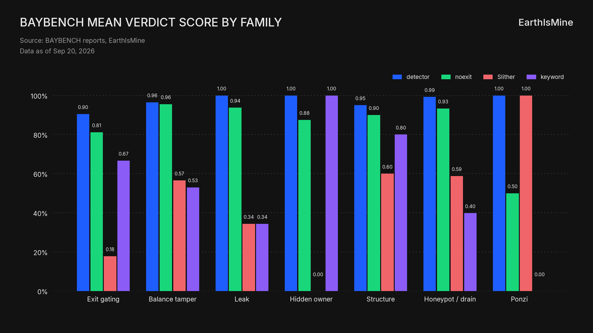
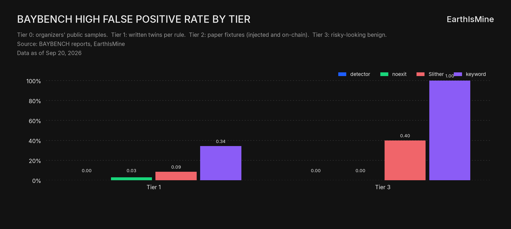
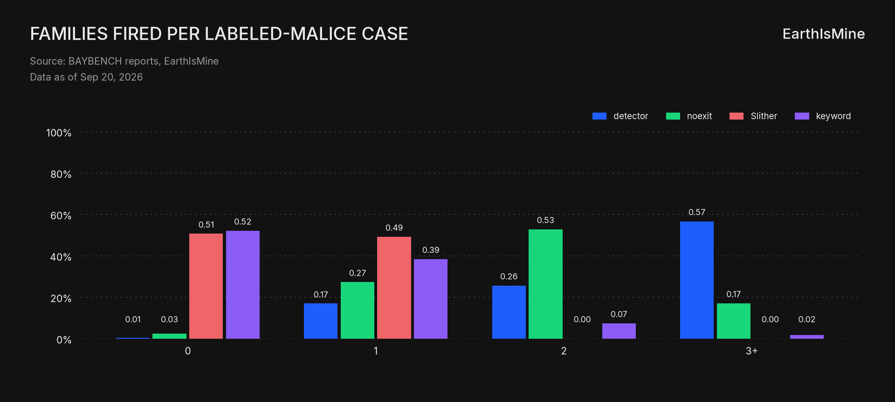

# EarthIsMine on BAYBENCH: model and results (20 Sep 2026)

- **Status:** number ledger (seed for a paper; not the spec; not the session brief)
- **Date:** 2026-09-20
- **Snapshot:** Phase 5 decisive mode, n=859. Local rerun `--no-docker --repeat 1` after `799361b`. Detector weighted matches the Docker all-tier report (`0.9714`). noexit is T404 `16fac68`.
- **Team:** EarthIsMine (`detector` and `noexit`)
- **Spec:** [../specs/baybench.md](../specs/baybench.md), [../specs/detector.md](../specs/detector.md)
- **Taxonomy:** [track1-malice-patterns.md](track1-malice-patterns.md)
- **Main session brief:** [../main-session-handoff.md](../main-session-handoff.md)
- **Paper PDF:** [earthismine-baybench-paper.pdf](earthismine-baybench-paper.pdf) ([source](earthismine-baybench-paper.md))
- **Charts:** [`reports/`](../../reports/) (`baybench_*.png`)
- **Numbers:** `reports/{detector,noexit,baseline_slither,baseline_keyword}/report.json` only. Nothing here is invented.

This note freezes what the current model is and what the current bench run said, so a later paper can cite one snapshot. It is the **number ledger** for the main session. Interpretation and the next move live in the [main session brief](../main-session-handoff.md). Parent Acceptance stays in the specs.

---

## 1. What we ship

EarthIsMine is the team. Two tools sit on the same bench:

- **detector:** static, name-agnostic predicates on Slither IR. Privilege, writable state, and whether that state gates transfer, balances, or an ETH/token exit. Offline. Submission mode prints the official JSON array to stdout. Bench mode writes `results.json`.
- **noexit:** teammate tool (T404 `16fac68`, 52 rule ids). Same grader. Registered only via `baybench/tools.yaml` (`${T404_DIR}/dist/baybench.js`).

Baselines on the same 859 files: **Slither native** (any High → Malicious) and **keyword** (name regex → Malicious).

### How detector decides (Phase 5 decisive mode)

1. Every catalog rule may emit a finding (rule id, family A–G, severity, contract, function, lines, reasoning).
2. Bounding discriminators (`constant_cap`, `fee_cap`, `ungate_exists`, `foreign_only`, `two_step_handoff`, …) set that finding to INFO. Governance notes (`managed_role`, `issuer_token`) annotate and leave HIGH. Concealment rules stay HIGH.
3. A **counting** finding is HIGH-base, or a decisive MED (`HONEYPOT_LEGACY`, `PONZI_SHAPE`, `STRUCT_PROXY_EOA_ADMIN`, `OWN_TX_ORIGIN`, `EXIT_TIME_GATE` with `no_expiry`), or an exploit-shape Slither overlay, with no bounding discriminator.
4. Verdict: any counting finding → Malicious; else `STRUCT_EXTERNAL_GATE` → Uncertain(`external_dependency`); else Benign. Compile fail / timeout / analysis error → Uncertain. Retired: `med_findings`, two-family escalation, `slither_high` as a verdict reason.

Findings are a list. If several rules match, several findings fire. Dedup is only `(rule_id, function, lines, severity)`. The verdict is one value.

## 2. What BAYBENCH is

Offline harness. A tool reads staged `.sol` and writes `results.json`. Verdicts are Benign | Malicious | Uncertain.

**Tiers (n=859)**

| Tier | n | What it is |
|---|---|---|
| 0 | 5 | Organizers' public samples (`challenge_public/`). Gate line `tier0_exact: k/5`. Weight **1.0** |
| 1 | 67 | Written malicious and benign twins, one pair per catalog rule, plus harness fixtures |
| 2 | 779 | Paper fixtures: Pied-Piper (injected and on-chain), CRPWarner, HoneyBadger Table 5. One paper category maps to one family |
| 3 | 8 | Risky-looking contracts (OZ, USDC, Bancor, and similar). Three now preferred Malicious (accepted Benign): USDC, Bancor, MiniMe/Lido. The other five must stay Benign with zero HIGH |

Charts keep the axis as Tier 0 / 1 / 2 / 3. The gloss lives under the title and in this table. We do not invent a second proper name for each tier.

**Headline score** is not case-weighted. It is the mean of per-tier means with weights T0=1, T1=2, T2=1, T3=2.

**Family recall** (malicious cases that have `expected_families`): share with at least one finding whose family is in that set. Any-hit, not all-hit. Verdict score is separate.

**HIGH False Positive:** Benign-preferred cases with any HIGH finding, over Benign-preferred cases. Uncertain on a lookalike does not count.

**Most T2 labels are single-tag.** 548 of 551 labeled-malice cases have exactly one expected family. The three exceptions are the Tier 3 files now tagged Malicious (Bancor, Lido, USDC).

## 3. Headline results

Local rerun 2026-09-20, `--no-docker --repeat 1`, all tiers. Detector wall 304.8 s. noexit wall 19.6 s (`T404_DIR=~/T404`, `16fac68`). Slither wall 66.5 s (local process-pool). Keyword 0.38 s.

| Tool | Weighted | Mean verdict | Family recall | HIGH-FP | Compile fail | Tier 0 exact |
|---|---|---|---|---|---|---|
| detector | 0.9714 | 0.9008 | 0.9201 | 0.0 | 190 | 5/5 |
| noexit (`16fac68`) | 0.9194 | 0.7989 | 0.6933 | 0.0238 | 0 | 5/5 |
| Slither | 0.6298 | 0.6612 | 0.0036 | 0.119 | 0 | 3/5 |
| keyword | 0.4269 | 0.3513 | 0.1906 | 0.4286 | 0 | 3/5 |

Detector weighted **matches** the Phase 5 Docker all-tier report (`799361b`, `--repeat 2`, determinism pass). This local run is `--repeat 1`, so determinism is `-`.

Previous snapshot (pre-Phase-5 labels, n=853, no Tier 0): detector 0.8709 / noexit `890405f` 0.7745 / Slither 0.5990 / keyword 0.3978. Do not mix those rows with this table. The mix, labels, weights, and `decide()` all changed.

**By tier (mean verdict)**

| Tool | Tier 0 (5) | Tier 1 (67) | Tier 2 (779) | Tier 3 (8) |
|---|---|---|---|---|
| detector | 1.0 | 1.0 | 0.8909 | 0.9688 |
| noexit (`16fac68`) | 1.0 | 0.8955 | 0.7875 | 0.9688 |
| Slither | 0.6 | 0.5672 | 0.6694 | 0.6875 |
| keyword | 0.6 | 0.597 | 0.3299 | 0.2188 |

**Detector family recall by family** (labeled malice): A Exit gating 0.981 (n=105), B Balance tamper 0.8785 (n=107), C Leak 1.0 (n=8), D Hidden owner 1.0 (n=4), E Structure 1.0 (n=5), F Honeypot / drain 0.9105 (n=324), G Ponzi 1.0 (n=1).

**Detector HIGH False Positive:** 0.0 on 42 preferred-Benign files (Tier 1 twins and the five lookalikes that must stay Benign).

**Detector family mean verdict:** A 0.9048, B 0.965, C 1.0, D 1.0, E 0.95, F 0.9923, G 1.0.

## 4. What the charts show

Use the named-axis files. Chat caches old PNG paths; `baybench_tier_named.png` and `baybench_family_named.png` are the current ones.

On 551 labeled-malice cases, detector lists 3+ families on 312 (57%). Mean families fired 2.82; mean extra (not the paper tag) 1.89. 307 of those 312 are still Malicious. That is over-attribution of findings, not a False Positive verdict. HIGH-FP is the over-call brake and is 0.0.

The extras are often the same paper trick under our catalog split (HoneyBadger `Withdraw()` labeled F, also C/D; Pied-Piper `destroy` labeled B, also C/D), not “the paper missed that the contract is a scam.” Real compounds exist and are unlabeled. `tool_gaps` only queues required-tag misses, so extras never enter the iterate list.

## 5. Limits (for a later paper)

- 190 detector compile fails (same count as the Docker report). Family recall on T2 includes those Uncertain rows.
- T2 has no `expected_rule_ids`. Per-rule charts are rule twins only (`reports/baybench_rules_family_{a-g}.png`).
- Chart: `baybench_score_tier3_lookalikes.png`.
- Slither family recall is near zero because High findings are not mapped onto A–G.
- Aderyn and Mythril were not installed. Not in the table.
- Runtime p50/p95 in the reports are wall times of the whole run, not per contract.
- Official Track 1 grades a stdout JSON array, not this `results.json`. Tier 0 5/5 is the ingested public set under BAYBENCH labels.

## 6. What a paper still needs

Henry owns the reader and the outline. This file stays the number ledger.

A later article should decide: paper-tag recall (what BAYBENCH measures now) versus multi-pattern attribution (what detector already emits). Those are different claims. Mixing them makes 0.920 family recall look like “we listed every pattern,” which this bench cannot say.
